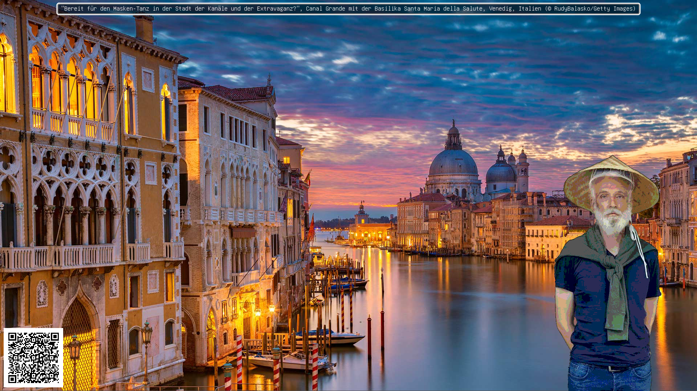
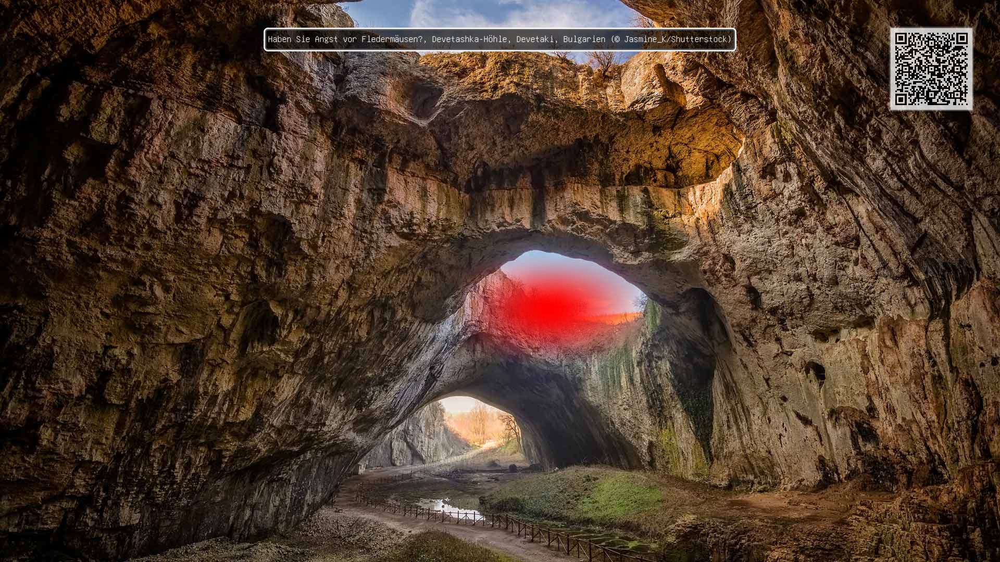
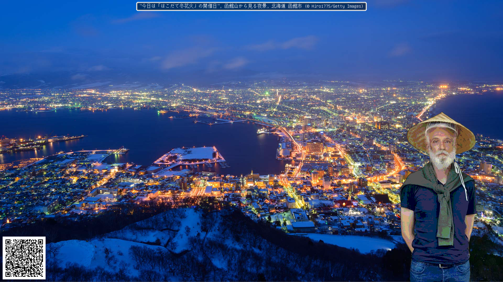

[](https://github.com/sarumaj/bing-wallpaper-changer/actions/workflows/test_and_report.yml)
[](https://github.com/sarumaj/bing-wallpaper-changer/actions/workflows/build_and_release.yml)
[](https://goreportcard.com/report/github.com/sarumaj/bing-wallpaper-changer)
[](https://codeclimate.com/github/sarumaj/bing-wallpaper-changer/maintainability)
[](https://codeclimate.com/github/sarumaj/bing-wallpaper-changer/test_coverage)
[](https://pkg.go.dev/github.com/sarumaj/bing-wallpaper-changer)
[](https://go.dev)
[](https://github.com/sarumaj/bing-wallpaper-changer/releases/latest)
[](https://github.com/sarumaj/bing-wallpaper-changer/releases/latest)
[](https://github.com/sarumaj/bing-wallpaper-changer/releases/latest)
[](https://github.com/sarumaj/bing-wallpaper-changer/releases)
[](https://github.com/sarumaj/bing-wallpaper-changer/releases/latest)

---

# bing-wallpaper-changer

**bing-wallpaper-changer** is a cross-platform compatible wallpaper-changer (CLI).

It fetches the newest Bing wallpaper and sets it as a desktop background image.
Custom watermark can be used on the downloaded image.
Done just for fun 😄

## Features

- [x] Crawl and fetch newest Bind wallpaper
  - [x] Support multiple regions
  - [x] Support multiple screen resolutions (😡 UltraHD is broken on the Bing side)
  - [x] Download wallpapers up to seven days in the past
- [x] Draw title on wallpapers
- [x] Place QR code for the copyright links
- [x] Draw watermarks
  - [x] Scale down/up to match the resolution of the wallpaper
  - [x] Rotate if necessary (only clockwise rotation by 90° supported)

## Usage

```console
$ bing-wallpaper-changer -h
>
> Usage: bing-wallpaper-changer [flags]
>       --day int                     the day to fetch the wallpaper for, 0 is today, 1 is yesterday, and so on, 7 is the highest value, which is seven days ago
>       --description                 draw the description on the wallpaper (default true)
>       --download-directory string   the directory to download the wallpaper to (default "~/Pictures/BingWallpapers")
>       --download-only               download the wallpaper only
>       --qrcode                      draw the QR code on the wallpaper (default true)
>       --region string               the region to fetch the wallpaper for, allowed values are: en-CA, zh-CN, de-DE, ja-JP, en-NZ, en-GB, en-US (default "de-DE")
>       --resolution string           the resolution of the wallpaper, allowed values are: 1366x768, 1920x1080, 3840x2160 (default "1920x1080")
>       --rotate-counter-clockwise    rotate the watermark counter-clockwise if necessary (default is clockwise)
>       --watermark string            draw the watermark on the wallpaper (default "sarumaj.png")

```

## Examples

### Default

Using default parameters:



### Resized watermark

Using small PNG watermark: [red-dot.png](pkg/extras/watermarks/red-dot.png)



### Rotated watermark

Using vertical (portrait-mode) PNG watermark: [car.png](pkg/extras/watermarks/car.png)


### Fetching Bing wallpaper for the ja-JP region

Using default parameters with region set to `ja-JP`:


