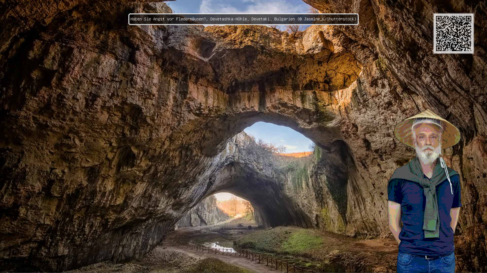
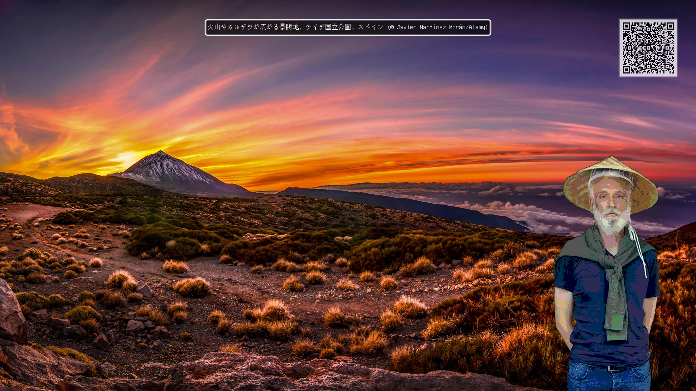

[](https://github.com/sarumaj/bing-wallpaper-changer/actions/workflows/test_and_report.yml)
[](https://github.com/sarumaj/bing-wallpaper-changer/actions/workflows/build_and_release.yml)
[](https://goreportcard.com/report/github.com/sarumaj/bing-wallpaper-changer)
[](https://codeclimate.com/github/sarumaj/bing-wallpaper-changer/maintainability)
[](https://codeclimate.com/github/sarumaj/bing-wallpaper-changer/test_coverage)
[](https://pkg.go.dev/github.com/sarumaj/bing-wallpaper-changer)
[](https://go.dev)
[](https://github.com/sarumaj/bing-wallpaper-changer/releases/latest)
[](https://github.com/sarumaj/bing-wallpaper-changer/releases/latest)
[](https://github.com/sarumaj/bing-wallpaper-changer/releases/latest)
[](https://github.com/sarumaj/bing-wallpaper-changer/releases)
[](https://github.com/sarumaj/bing-wallpaper-changer/releases/latest)

---

# bing-wallpaper-changer

**bing-wallpaper-changer** is a cross-platform compatible wallpaper-changer (CLI).

It fetches the newest Bing wallpaper and sets it as a desktop background image.
Custom watermark can be used on the downloaded image.
GCP support for the translation and text2speech is provided as well.
Done just for fun 😄

## Features

- [x] Crawl and fetch newest Bind wallpaper
  - [x] Support multiple regions
  - [x] Support multiple screen resolutions (😡 UltraHD is broken on the Bing side)
  - [x] Download wallpapers up to seven days in the past
- [x] Draw title on wallpapers
  - [x] Support Google Cloud Translation Service for translation to English
  - [x] Support Google Cloud Text2Speech Service for accessibility (playing the sound on darwin and linux only if compiled with CGO)
- [x] Place QR code for the copyright links
- [x] Draw watermarks
  - [x] Scale down/up to match the resolution of the wallpaper
  - [x] Rotate if necessary (only clockwise rotation by 90° supported)
- [x] System tray interface (available on darwin and linux only if compiled with CGO)

## Platform specific notes

### Linux

- Requires `libasound2-dev`, `libx11-dev` or `xorg-dev` or `libX11-devel` (on Ubuntu/Debian), `alsa-lib-devel` (on RedHat/Fedora)

### Darwin

- Requires CGO, `AudioToolbox.framework` (but it is automatically linked)

### Windows

- No additional requirements

## Usage

```console
$ bing-wallpaper-changer -h
>
>Usage of bing-wallpaper-changer:
>
>Flags:
>
>      --daemon                              run the application as a daemon process
>      --day Enum[types.Day]                 the day to fetch the wallpaper for, allowed values are: today, 1 days ago, 2 days ago, 3 days ago, 4 days ago, 5 days ago, 6 days ago, 7 days ago (default today)
>      --debug                               enable debug mode
>      --description                         draw the description on the wallpaper (default true)
>      --download-directory string           the directory to download the wallpaper to (default "~/Pictures/BingWallpapers")
>      --download-only                       download the wallpaper only
>      --furigana-api-app-id string          the Goo Labs API App ID (labs.goo.ne.jp) for the furigana service, if not provided, Jisho.org (if available) or github.com/sarumaj/go-kakasi will be used
>      --google-app-credentials string       the path to the Google App credentials file for the translation service for pt-BR, fr-CA, zh-CN, fr-FR, de-DE, it-IT, hi-IN, ja-JP, es-ES to en-US,
>                                            if not provided, the translation service will not be used
>      --mode Enum[core.Mode]                the mode of the wallpaper, allowed values are: [center crop fit span stretch tile] (default fit)
>      --qrcode                              draw the QR code on the wallpaper (default true)
>      --region Enum[types.Region]           the region to fetch the wallpaper for, allowed values are: pt-BR, en-CA, fr-CA, zh-CN, fr-FR, de-DE, it-IT, hi-IN, ja-JP, en-NZ, es-ES, en-ROW, en-GB, en-US (default de-DE)
>      --resolution Enum[types.Resolution]   the resolution of the wallpaper, allowed values are: 1366x768 (SD), 1920x1080 (HD), 3840x2160 (UHD) (default 1920x1080)
>      --rotate-counter-clockwise            rotate the watermark counter-clockwise if necessary (default is clockwise)
>      --use-google-text2speech-service      use the Google Text2Speech service to record and play the audio description (not supported on darwin, and linux unless compiled with cgo)
>      --use-google-translate-service        use the Google Translate service to translate the description to English
>      --watermark string                    draw the watermark on the wallpaper (default "sarumaj.png")
>
```

## Examples

### Default

Using default parameters:



### Resized watermark

Using small PNG watermark: [red-dot.png](pkg/extras/watermarks/red-dot.png)


### Rotated watermark

Using vertical (portrait-mode) PNG watermark: [car.png](pkg/extras/watermarks/car.png)


### Fetching Bing wallpaper for the ja-JP region

Using default parameters with region set to `ja-JP`:


